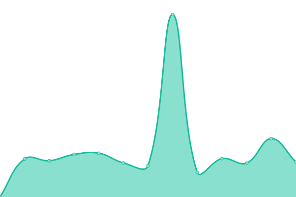

# [📈 Live Status](https://status.desirable.app): <!--live status--> **🟧 Partial outage**

This repository contains the open-source uptime monitor and status page for [Stoked Consulting](stokedconsulting.com), powered by [Upptime](https://github.com/upptime/upptime).

With [Upptime](https://upptime.js.org), you can get your own unlimited and free uptime monitor and status page, powered entirely by a GitHub repository. We use [Issues](https://github.com/stokedconsulting/status/issues) as incident reports, [Actions](https://github.com/stokedconsulting/status/actions) as uptime monitors, and [Pages](https://status.desirable.app) for the status page.

<!--start: status pages-->
<!-- This summary is generated by Upptime (https://github.com/upptime/upptime) -->
<!-- Do not edit this manually, your changes will be overwritten -->
<!-- prettier-ignore -->
| URL | Status | History | Response Time | Uptime |
| --- | ------ | ------- | ------------- | ------ |
|  [Desirable Web App](https://desirable.app) | 🟩 Up | [desirable-web-app.yml](https://github.com/stokedconsulting/status/commits/HEAD/history/desirable-web-app.yml) | 

 2559ms
     
 | 

<a href="https://status.desirable.app/history/desirable-web-app">100.00%</a>
    

|  [API Service](https://api.desirable.app/v3.0/health) | 🟥 Down | [api-service.yml](https://github.com/stokedconsulting/status/commits/HEAD/history/api-service.yml) | 

 0ms
     
 | 

<a href="https://status.desirable.app/history/api-service">0.00%</a>
    

|  [WebRTC Service](https://webrtc.desirable.app/health) | 🟥 Down | [web-rtc-service.yml](https://github.com/stokedconsulting/status/commits/HEAD/history/web-rtc-service.yml) | 

 0ms
     
 | 

<a href="https://status.desirable.app/history/web-rtc-service">0.00%</a>
    

|  [Chat Service](https://chat.desirable.app/chat/health) | 🟥 Down | [chat-service.yml](https://github.com/stokedconsulting/status/commits/HEAD/history/chat-service.yml) | 

 0ms
     
 | 

<a href="https://status.desirable.app/history/chat-service">0.00%</a>
    

<!--end: status pages-->

[**Visit our status website →**](https://status.desirable.app)

## 📄 License

- Powered by: [Upptime](https://github.com/upptime/upptime)
- Code: [MIT](./LICENSE) © [Anand Chowdhary](https://anandchowdhary.com), supported by [Pabio](https://pabio.com)
- Data in the `./history` directory: [Open Database License](https://opendatacommons.org/licenses/odbl/1-0/)
